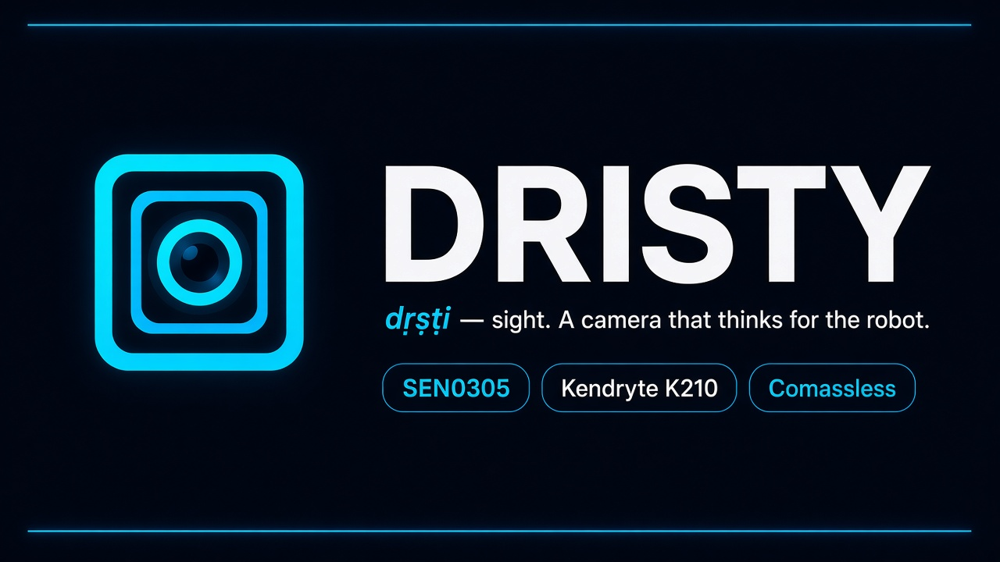
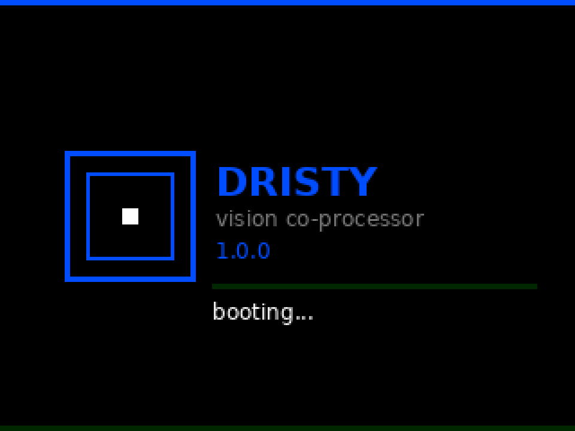
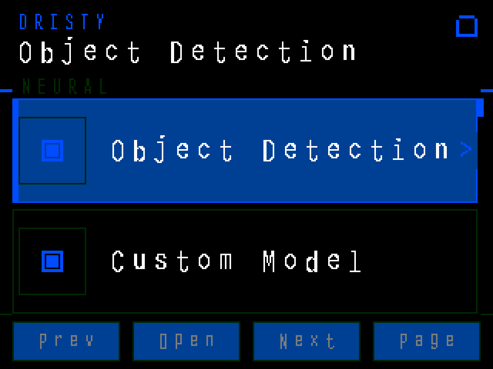
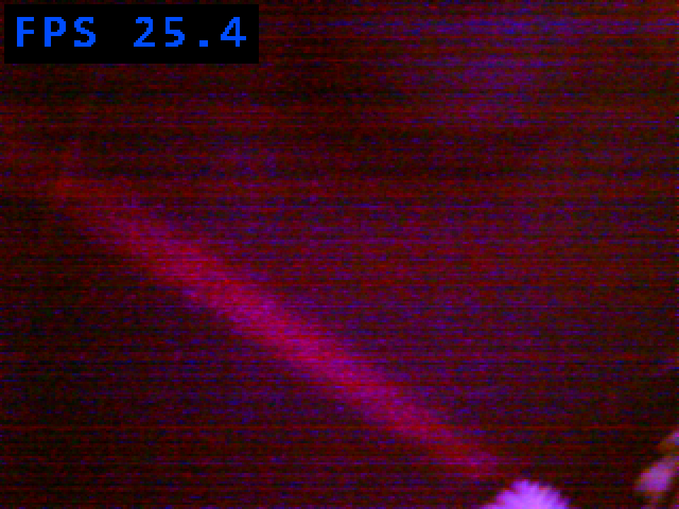
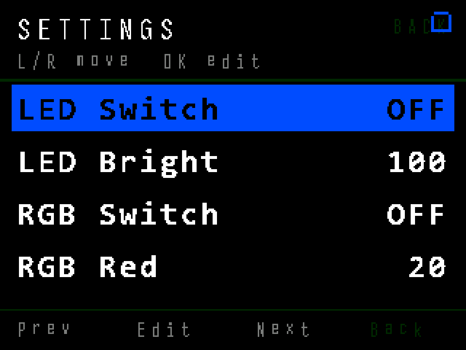
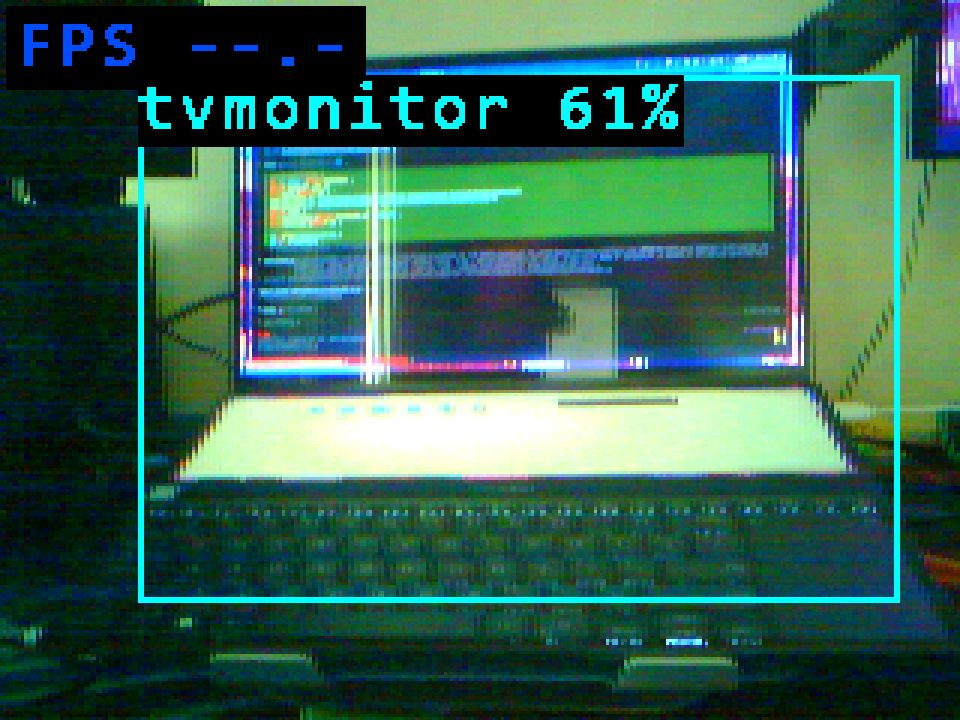
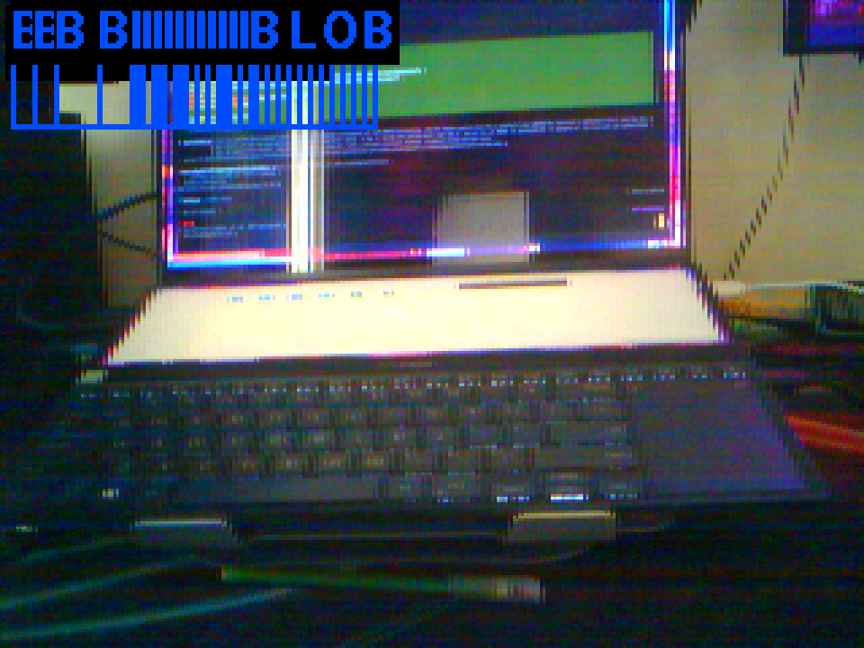
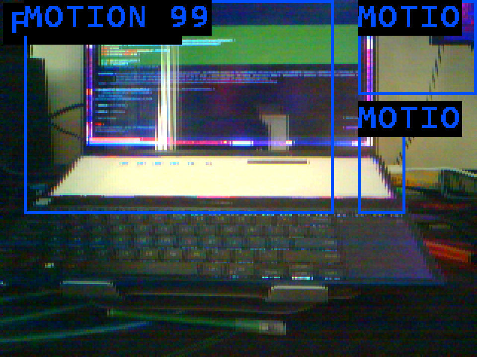
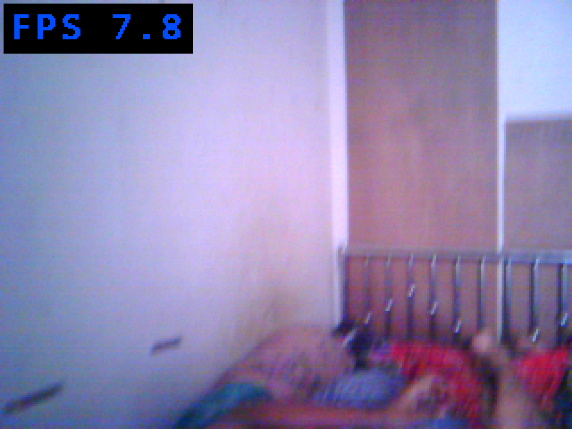
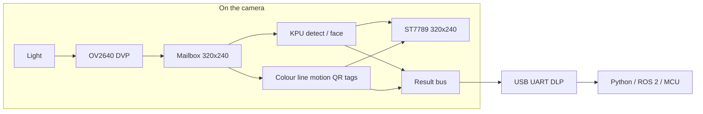

<p align="center">
  
</p>

<p align="center">
  
</p>

<h1 align="center">Dristy</h1>

<p align="center">
  <strong>দৃষ্টি</strong> — Bengali for <em>sight</em>.<br/>
  Open firmware and host API for a Kendryte <strong>K210</strong> camera that thinks for the robot.
</p>

<p align="center">
  <a href="https://github.com/fh1m/Dristy"></a>
  
  
  
</p>

<p align="center">
  <em>Comassless — Muhammad Fahim Faisal &amp; Rakibul Islam</em>
</p>

---

## Start here (no jargon)

A robot does not “see.” It has a **sensor** that turns light into numbers, and a **program** that has to decide what those numbers mean *before* the motors move.

Dristy is that program, running **on the camera itself**:

1. Light hits the lens.
2. A cheap CMOS imager (OV2640) writes a **320×240** picture into the chip’s RAM.
3. The K210 either runs a tiny neural net on its **KPU**, or runs classical vision (colour, line, motion, QR, tags) on the two RISC-V cores.
4. The LCD shows you what it thinks — boxes, labels, histograms.
5. Over USB serial it sends a compact answer: “object at error_x, error_y” — not a video stream the flight computer has to decode.

You are not training a datacenter model. You are giving a 64-pin camera a **job**: look, decide, report.


The golden rule: **keep the newest frame, throw the rest away.** A robot that steers on a picture from 200 ms ago is worse than a robot that missed a frame. Dristy is a mailbox, not a queue.

---

## This README is from a live board

Every LCD picture below was pulled over UART (`HKSHOT`) from a **DFRobot SEN0305** on `/dev/ttyUSB0` on 19 Sep 2026. The overlay text is the device’s own 320×240 UI, scaled 3× with nearest-neighbour so you can read the pixels.

The boot splash cannot be captured the same way: the debug UART listener starts **after** the 1.8 s logo. The first image is a pixel-geometry reconstruction from `dristy_boot_view.c` (same cyan `0x027F`, same nested square). Everything after it is a real dump of the running LCD.

<table>
<tr>
<td width="50%">



**Boot** — name, job, version. Then the menu.

</td>
<td width="50%">



**Live menu** — Neural / classical / hybrid modes. `Prev` `Open` `Next` `Page` match the four buttons.

</td>
</tr>
<tr>
<td>



**Camera** — raw OV2640 preview at **25.4 FPS** (dark scene, then we pointed it at a laptop).

</td>
<td>



**Settings** — illumination LED, RGB, brightness. Same cyan highlight as the menu.

</td>
</tr>
</table>

---

## What Dristy can do (shown, not claimed)

Point the module at the world. It does not upload the picture to a PC for “AI.” The K210 **is** the computer.

### 1. Name the thing in front of you

Live capture, object-detect app, Pascal VOC-20 model from the SD card:

<p align="center">
  
</p>

That cyan rectangle and the label **`tvmonitor 61%`** were drawn **on the device**. A laptop is close enough to the “tvmonitor” class the tiny YOLO was trained on — which is exactly how you should think about on-device nets: they are **small, opinionated, and honest about confidence**.

Use this when a rover should stop for a person-sized blob, or a drone should keep a known object in frame.

### 2. Follow colour without a neural net

<p align="center">
  
</p>

Colour tracking is **histogram + blobs** on the CPU. No kmodel. On this hardware it ran in the high teens of FPS with **16 live blobs** in a desk audit. Use it for line tape, buoys, landing pads painted a known hue.

### 3. Notice that something moved

<p align="center">
  
</p>

Motion mode diffs frames and draws regions. This shot reports **MOTION 99** while the scene (and the laptop screen) is changing. Use it as a tripwire: “wake the expensive detector only if the world moved.”

### 4. Read codes and just look

<table>
<tr>
<td width="50%">



**QR camera** — live room at **7.8 FPS** while the decoder runs. Point at a printed QR and the payload comes back on the same UART.

</td>
<td width="50%">

**Also on the same firmware**

- AprilTag / ArUco (need a printed marker in view)
- Line follow (regression on a contrast strip)
- Optical flow (how the scene is sliding)
- Face detect (KPU)
- Hybrid “detect + track” for a lock that survives a missed frame

</td>
</tr>
</table>



---

## Why a co-processor (first principles)

A flight controller or Raspberry Pi **can** run vision. Usually you should not make it.

| If the brain does vision | If Dristy does vision |
|---|---|
| It must ingest JPEG/YUV at tens of FPS | It sends **a few bytes**: id, x, y, size |
| A stall in OpenCV stalls attitude control | The robot loop stays boring and fast |
| You debug “why is my PID late?” | You debug “is the box on the LCD?” |

Dristy is the same idea as a GPS module: **a specialist that speaks a short protocol.**

USB `/dev/ttyUSB0` is the debug and screenshot port (this README). The Grove UART on the side of the SEN0305 is the **robot** port (115200 8N1, same framing).

Framing is the industry-common `0x55 0xAA` camera packet. Stock commands `0x20–0x3E` still knock. Dristy commands `0x40–0x7F` set mode, read tracks, blobs, flow, motion, LCD, LEDs.

```python
from dristy import Dristy

with Dristy("/dev/ttyUSB0") as cam:
    print(cam.identify())          # DRISTY 1.0.0
    cam.set_mode("detect")         # or colour_track, motion_detect, ...
    frame = cam.read()
    if frame.target:
        print(frame.target.error_x, frame.target.error_y)
```

---

## The chip you are actually programming

Kendryte **K210**: two 64-bit RISC-V cores + a 64-lane conv engine (KPU) + 8 MiB SRAM, 16 MiB SPI flash, no Linux, no MMU. The SEN0305 hangs an OV2640, an ST7789 LCD, three menu buttons, LEDs, SD, and USB-UART off that die.


Dristy raises **PLL1 to 400 MHz** at boot (~+33% KPU vs a 300 MHz default) *before* anyone micro-optimises C. Model input widths are multiples of **64** so the DVP can DMA into AI SRAM without the CPU touching pixels.

One camera owner at a time. The LCD preview and the neural net **share** the same DVP lease. That is why “open object detect” after “open camera” has to stop the previous owner — not a bug, physics of one pipe.

---

## Measured on this SEN0305

Host `SET_MODE` / `GET_RESULT` audit, desk scene, firmware SHA `ba99adb6…`. `mode_ok` means the protocol handshake worked. Zeros mean the **scene** had no tag/face/QR, not that the mode is dead. Colour, line, flow, and motion produced live counts.

| Job | Mode | What we saw |
|---|---|---|
| VOC detect | `DETECT` | mode_ok, ~7 FPS when the net runs |
| Your kmodel | `DETECT_CUSTOM` | mode_ok (needs a file on SD) |
| Colour | `COLOUR_TRACK` | **16 blobs**, ~19 FPS |
| Line | `LINE_FOLLOW` | line valid, ~20 FPS |
| Flow | `OPTICAL_FLOW` | flow cell live |
| Motion | `MOTION_DETECT` | **55%** then the LCD shot above at 99 |
| Tags / QR / face | those modes | mode_ok; 0 hits until you show a marker/face |
| LCD menu | buttons + `HKSHOT` | this README |

Full table: [`docs/audit/FULL_MODE_AUDIT.md`](docs/audit/FULL_MODE_AUDIT.md).

---

## Talk to it

```bash
# Python API
pip install -e dristy/dristy-py
python3 - <<'PY'
from dristy import Dristy
with Dristy("/dev/ttyUSB0") as cam:
    cam.set_mode("colour_track")
    print(cam.read())
PY

# Pull the LCD (what this README used)
cd dristy/firmware/k210
sudo python3 tools/hkflash.py screenshot --board sen0305 --port /dev/ttyUSB0 \
  --timeout 60 -o /tmp/lcd.bmp
```

Buttons on the module: **L/R** previous/next, **OK** open, **BACK** page up.

---

## Build and flash (SEN0305)

Need the Kendryte toolchain once (`python3 tools/bootstrap_deps.py` inside the firmware tree).

```bash
cd dristy/firmware/k210
source env.sh   # or: python3 tools/bootstrap_deps.py
python3 tools/build_firmware.py full --board sen0305
python3 tools/check_build_freshness.py
sudo python3 tools/hkflash.py flash dist/dristy-full-sen0305.bin \
  --board sen0305 --port /dev/ttyUSB0 --uploader-reset
sudo python3 tools/dristy_mode_smoke.py --port /dev/ttyUSB0
```

If a build fails, **do not flash** `dist/*.bin` — it may be yesterday’s image. Freshness check compares SHA to `firmware/src/`.

CP210x USB-UART: DTR/RTS **reset the K210**. Screenshot and doctor tools hold them low on purpose. Opening a random serial monitor can reboot the board; that is how the live shots were triggered.

---

## Repository map

| Path | What it is |
|---|---|
| [`docs/media/live/`](docs/media/live/) | UART LCD dumps used above |
| [`docs/CONTINUITY.md`](docs/CONTINUITY.md) | Flash traps, camera lease, known failures |
| [`docs/DRISTY_INVARIANTS.md`](docs/DRISTY_INVARIANTS.md) | Rules the firmware must not break |
| [`docs/audit/`](docs/audit/) | Mode-by-mode hardware evidence |
| [`dristy/docs/DRISTY_ARCHITECTURE.md`](dristy/docs/DRISTY_ARCHITECTURE.md) | Binding architecture (memory, pipeline, protocol) |
| [`dristy/firmware/k210/`](dristy/firmware/k210/) | Firmware, `hkflash`, smoke/stress |
| [`dristy/dristy-py/`](dristy/dristy-py/) | Host Python (`from dristy import Dristy`) |
| [`AGENTS.md`](AGENTS.md) | How an agent should verify on hardware |

---

## Status

**Pause (Sep 2026).** Firmware on the SEN0305 boots as Dristy 1.0.0, menu and classical/neural modes are exercised live, host SET_MODE is 18/18 `mode_ok`. Still open later: a dedicated classify kmodel, user custom detect model on device, prettier overlay fonts in colour mode.

MIT — see [LICENSE](LICENSE).
