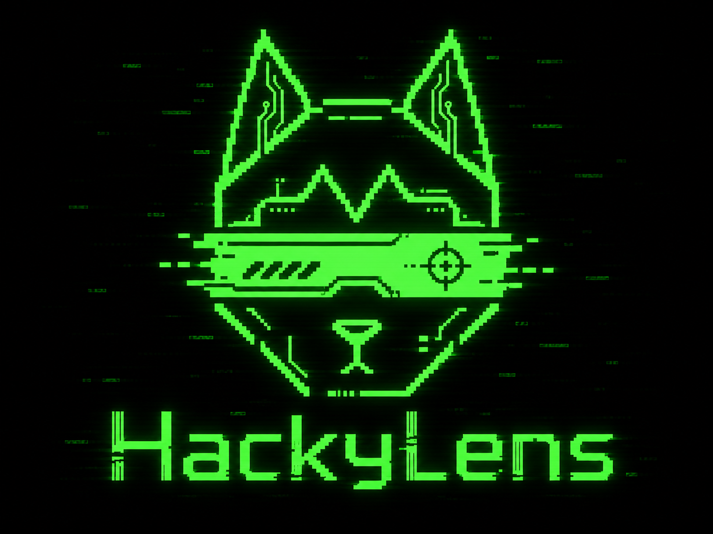
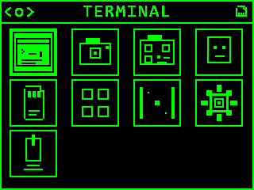
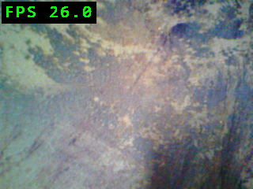
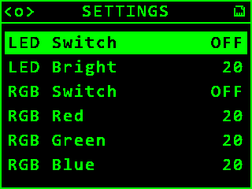

<div align="center">
  
  <h1>HackyLens</h1>
  <p><strong>Open-source modular firmware for HUSKYLENS and the Kendryte K210.</strong></p>
  <p>
    <a href="VERSION"></a>
    <a href="LICENSE"></a>
    <a href="https://www.dfrobot.com/product-1922.html?srsltid=AfmBOopFLFOvPDHc_IyIEzhXPL2jOfHyxDgTjD5jBq53ne3zEmhpjHFF"></a>
    
  </p>
</div>

HackyLens provides a compact on-device environment for camera experiments, QR scanning, face detection, file browsing, diagnostics, and small interactive apps.

> [!IMPORTANT]
> HackyLens v0.4 is a layered K210 reference firmware and MicroPython technology
> preview. The primary project goal is a lightweight, portable application
> architecture for robotics hardware: board-independent feature apps, explicit
> platform capabilities, and a direct path from MicroPython prototypes to native
> apps. See the [architecture vision](docs/ARCHITECTURE_VISION.md),
> [current-state audit](docs/CURRENT_STATE.md), and
> [platform roadmap](docs/ROADMAP.md).

> [!WARNING]
> Flashing custom firmware replaces the firmware currently installed on the device. Make sure you are comfortable entering the K210 bootloader and restoring your preferred firmware before proceeding.

## Hardware

Development and hardware testing were performed on the [DFRobot HUSKYLENS SEN0305](https://www.dfrobot.com/product-1922.html?srsltid=AfmBOopFLFOvPDHc_IyIEzhXPL2jOfHyxDgTjD5jBq53ne3zEmhpjHFF). Other HUSKYLENS revisions may differ, so verify the board, flash layout, and pin mapping before using this firmware on another revision.

## Features

- Live OV2640 camera preview with configurable capture and display settings
- QR scanning powered by [quirc](https://github.com/dlbeer/quirc)
- KPU-based face detection
- KPU Tiny-YOLOv2 object detection with 20 Pascal VOC classes
- Shared K210 AI-model runtime with validated SD manifests and conversion tools
- FAT32 SD-card support, photo capture, screenshots, and an image viewer
- On-device terminal with bounded history and scrolling
- Built-in file browser, button tester, Pong, settings, and sleep mode
- Embedded upstream MicroPython on K210 core 1 with bounded heap, execution
  deadline, native-iterator-aware STOP/BACK, WDT1 recovery, stdout events, and
  deterministic cooperative cleanup
- Atomic littlefs script storage in validated 16 MiB internal flash, with CRC,
  startup selection, a framed serial protocol, Python CLI, and Web Serial IDE
- Compile-time app registry: omit individual apps from custom builds
- UART tooling for flashing, logs, commands, LCD screenshots, and raw camera frames
- Layered C codebase with an automated architecture-boundary check

## Screenshots

| Main menu | Live camera | Settings |
| --- | --- | --- |
|  |  |  |

These 320 x 240 images were captured directly from a running HUSKYLENS over the firmware's UART screenshot protocol.

## Included apps

`TERMINAL`, `CAMERA`, `QR-CAMERA`, `FACE DETECT`, `APRILTAG`, `OBJECT DETECT`,
`MICROPYTHON`, `FILES`, `BUTTONS`, `PONG`, `SETTINGS`, and `SLEEP`

## SD models

The tracked `sdcard/` directory mirrors the card root. Copy its contents onto
a FAT32 card so `hackylens.kmodels` is at the root. It includes the FACE model
and the verified VOC20 OBJECT package. See [AI models](docs/AI_MODELS.md) for
the exact model contract and reproducible fetch/package command.

## Build

The bootstrap script provisions the pinned Windows host and Kendryte
toolchains. Run the following commands from the repository root in PowerShell.

### Prerequisites

- Git
- Python 3
- CMake
- Ninja
- 7-Zip (used to unpack the SHA-256-pinned host GCC on Windows)
- Git for Windows (its Bash/coreutils are used by the upstream MicroPython generator)

Install the Python serial dependency:

```powershell
python -m pip install pyserial
```

Download the pinned host GCC, Kendryte SDK/toolchain, MicroPython, littlefs, and
flashing support files, then load the generated environment:

```powershell
python tools\bootstrap_deps.py
. .\env.ps1
python tools\check_env.py
```

Run the architecture check and build the full firmware:

```powershell
python tools\check_arch.py
python tools\build_firmware.py full --board huskylens-sen0305
```

The qualified firmware image, same-stem schema-1 flasher sidecar, and private
canonical build attestation are written to
`dist\hackylens-full-huskylens-sen0305.bin`,
`dist\hackylens-full-huskylens-sen0305.json`, and
`dist\hackylens-full-huskylens-sen0305.attestation.json`. The attestation binds
the exact image hash to the selected board/profile and complete app composition;
feature-disabled builds are not release-qualified. Tagged release artifacts use
the `dist\release\hackylens-huskylens-sen0305-v<version>.*` stem and include a
separate `-attestation.json` file.

Tagged releases are automated by `.github/workflows/release.yml`. A pushed
`vX.Y.Z` tag must match `VERSION`; CI builds the full firmware and publishes a
versioned binary, build attestation, SD-card model bundle, metadata, and SHA-256
checksums.

Apps can be excluded by repeating `--disable-app`:

```powershell
python tools\build_firmware.py full --board huskylens-sen0305 --disable-app pong --disable-app terminal
```

### HackyLens Code web IDE

The IDE now lives in the separate sibling repository `hackylens-code` (normally
checked out at `..\hackylens-code`). It contains the complete buildable source
tree derived from MIT-licensed Pybricks Code at pinned commit
`ea9af98d1fd0a842ed76d3a7f83767f363bc1b17`, plus the HackyLens Web Serial
transport, UI and tests:

```powershell
Set-Location ..\hackylens-code
node .yarn\releases\yarn-3.3.0.cjs install --immutable
node .yarn\releases\yarn-3.3.0.cjs typecheck
node .yarn\releases\yarn-3.3.0.cjs test
node .yarn\releases\yarn-3.3.0.cjs build
node .yarn\releases\yarn-3.3.0.cjs start
```

Open `http://127.0.0.1:4173/` in desktop Chrome or Edge. Web Serial requires a
secure context; localhost is accepted, while deployed builds require HTTPS.
The production site is written to that repository's `build` directory and is
released independently from the firmware/SD-card package.

## MicroPython workflow

The internal `userfs` partition is enabled only when JEDEC discovery confirms
exactly 16 MiB of flash. Unsupported 8 MiB revisions keep normal firmware
features but expose no script filesystem. Formatting is never automatic.

The on-device **MICRO-PYTHON** app lists stored `.py` files and provides RUN,
read-only source preview, scrollable logs, startup selection, and confirmed
deletion. Entering the app never executes a script automatically: the startup
selection is the persisted default used for initial selection and an empty-name
HMPY `RUN`. Uploading and editing remain PC/IDE operations.

The IDE covers edit, atomic upload, list/read/delete, startup selection,
run/stop/status, and live stdout/stderr. The same HMPY v1 workflow is available
from the reference CLI:

```powershell
python tools\hkpy.py ports
python tools\hkpy.py --port COM10 hello
python tools\hkpy.py --port COM10 upload .\main.py --startup --run
python tools\hkpy.py --port COM10 monitor
python tools\hkpy.py --port COM10 stop
```

The repeatable hardware runner is read-only by default. It records
HELLO/STATUS and one maximum 1024-byte PING before the separate filesystem gate,
so a corrupt partition does not hide healthy transport evidence. Reversible
storage, runtime, native-iterator STOP, and lease-reconnect checks are separate
opt-ins; FORMAT still requires its exact destructive token:

```powershell
python tools\hmpy_acceptance.py --port COM10
python tools\hmpy_acceptance.py --port COM10 --workflow --lease-reconnect
python tools\hmpy_acceptance.py --port COM10 --format-userfs --confirm-format "ERASE USERFS"
```

Fixture names are collision-checked and cleanup restores the baseline file list
and startup selection. The runner never formats an unformatted userfs unless
both FORMAT options are present.

The v0.2.0 CLI/HMPY workflow has passed on a physical SEN0305 after an explicitly
authorized USERFS format: atomic file operations, startup execution, cooperative
STOP (123 ms), native `sum`/`min` STOP (121 ms), executor reuse, lease reconnect,
and exact cleanup. Multi-device confirmation, long-duration NOR
endurance/power-loss, physical BACK, live browser Web Serial
edit/upload/run/log/stop/reconnect, WDT1 fault-injection, and 1000-cycle stress
remain separate qualification gates.

The default run deadline is 30 seconds and the maximum requested deadline is
300 seconds. API v1 exposes buttons, time/sleep, display, LED/RGB, and the
external UART/I2C connector. See [MicroPython API](docs/MICROPYTHON_API.md),
[HMPY protocol](docs/HMPY_PROTOCOL.md), and the
[architecture/research report](docs/MICROPYTHON_RESEARCH.md).

STOP is checked in bytecode and native iterator loops. If a native C call still
does not return after the STOP/deadline grace period, a one-shot WDT1 reset is
used; MicroPython autostart is held for that recovery boot to prevent loops.
HELLO exposes a backward-compatible `WDT1_RECOVERY` boot flag so clients can
report and acceptance-test that safe-boot path explicitly.
The reproducible, deliberately test-build-only procedure is documented in
[WDT1 hardware acceptance](docs/WDT_HARDWARE_ACCEPTANCE.md); production builds
do not expose a Python fault-injection API. The physical `-wdtfi` reset/recovery
gate has not yet been run.

## Flash and debug

There are three ways to install firmware:

- [HLWF Desktop](https://github.com/aztechell/HLWF-desktop) — an offline Windows x64 flasher with package validation, progress reporting, and recovery support.
- [HLWF](https://github.com/aztechell/HLWF) — a dependency-free browser uploader built on Web Serial.
- `tools/hkflash.py` — the repository's Python flashing and debug tool, intended for development workflows.
- `isp_stub/isp_prog_huskylens.bin` — the bundled display-aware K210 ISP stub used by `hkflash.py` by default.

List detected serial adapters:

```powershell
python tools\hkflash.py list
```

Flash the image and monitor the boot log:

```powershell
python tools\hkflash.py flash-monitor dist\hackylens-full-huskylens-sen0305.bin --board huskylens-sen0305 --port COM10
```

Capture the current LCD contents without a camera or screen-grabber:

```powershell
python tools\hkflash.py screenshot --board huskylens-sen0305 --port COM10 --output screen.bmp
```

Debug commands can also open firmware screens directly; for example:

```powershell
python tools\hkflash.py cmd HKSETTINGS --board huskylens-sen0305 --port COM10
```

Run `python tools\hkflash.py --help` or the help for an individual subcommand to see reset, baud-rate, verification, monitor, command, and frame-capture options.

## Project layout

| Path | Purpose |
| --- | --- |
| `firmware/src/apps` | App entry points and self-contained feature modules |
| `firmware/src/controllers` | User flows and screen coordination |
| `firmware/src/services` | Camera, QR, settings, debug, and screenshot services |
| `firmware/src/storage` | Internal flash/littlefs, FAT32, files, images, photos, and persistent data |
| `firmware/src/ui` | Screen rendering |
| `firmware/src/drivers` | Board-independent device drivers and services-facing hardware APIs |
| `boards` | Descriptor-driven board ports, generated headers, layouts, and selected BSPs |
| `platforms/k210/hal`, `platforms/k210/startup` | K210 HAL and platform startup composition |
| `firmware/src/runtime` | Startup and the main loop |
| `tools` | Dependency bootstrap, build, checks, flashing, and diagnostics |
| `models` | Locked K210 conversion workflow and model descriptor specs |
| `sdcard` | Files laid out exactly as they should appear on the FAT32 card |

HackyLens Code is intentionally maintained in the separate sibling
`hackylens-code` repository.

Project direction is defined by [Architecture vision](docs/ARCHITECTURE_VISION.md),
[Current state](docs/CURRENT_STATE.md), and the
[Platform roadmap](docs/ROADMAP.md). Implementation details are available in
[Architecture](docs/ARCHITECTURE.md), [Modules](docs/MODULES.md),
[AI models](docs/AI_MODELS.md), [App lifecycle](docs/APP_LIFECYCLE.md), and
[RAM/flash budget](docs/RAM_BUDGET.md).

Normative governance is indexed in the
[platform specifications](docs/spec/README.md). Significant architecture
decisions are recorded as [ADRs](docs/adr/README.md).

## License

HackyLens is released under the [MIT License](LICENSE).
